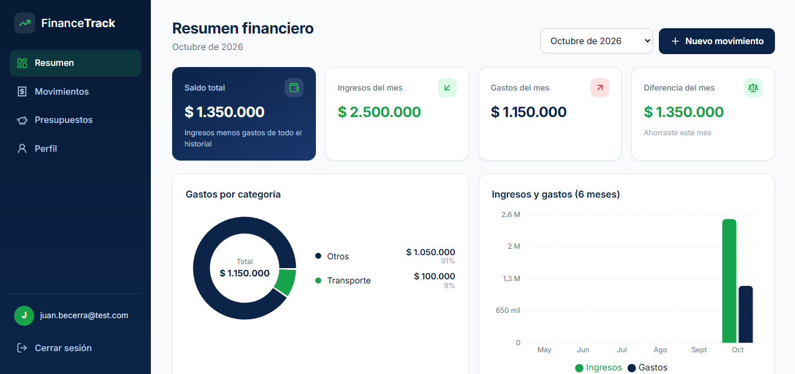
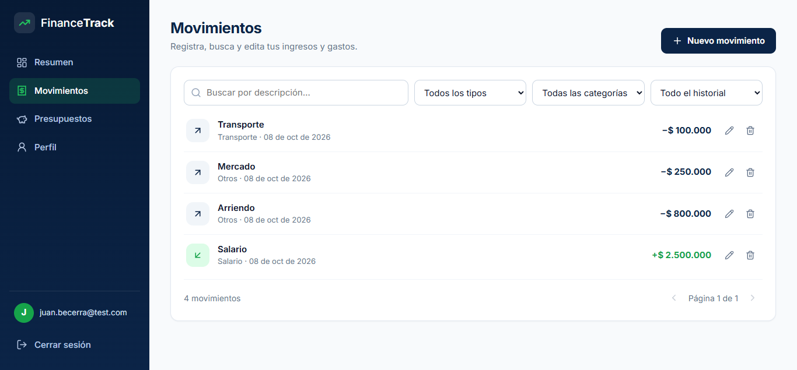
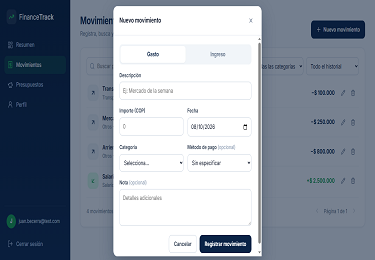
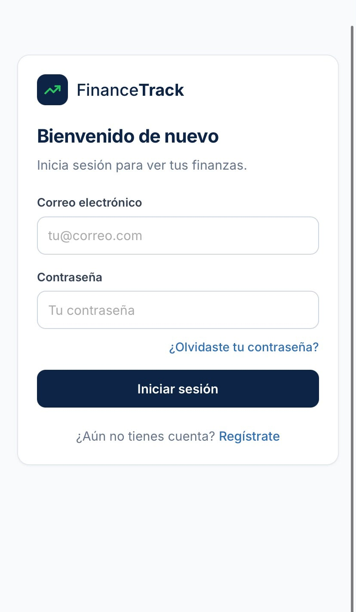
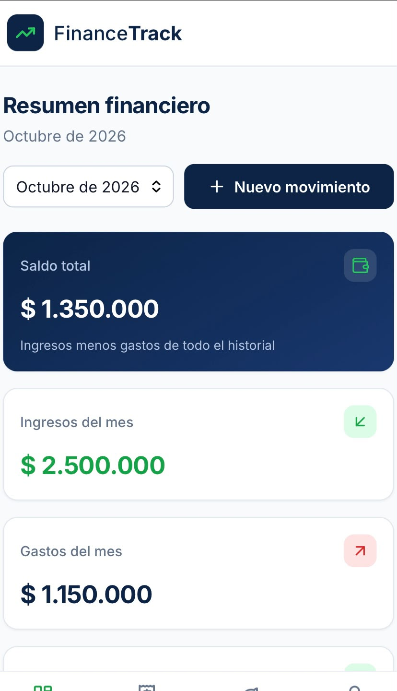

# FinanceTrack — Panel de Finanzas Personales

FinanceTrack es un panel de finanzas personales diseñado para ayudar a los usuarios a gestionar sus ingresos, gastos y transacciones mediante una interfaz intuitiva y organizada.

La aplicación ofrece una vista centralizada de la actividad financiera para facilitar el seguimiento de las transacciones y el control de las finanzas personales.

## 🚀 Demo en vivo

**[Ver FinanceTrack](https://financetrack-849c1.web.app/)**

## 📸 Capturas de pantalla

### 1. Panel principal

Vista general de la actividad financiera y la información más relevante del usuario.



### 2. Transacciones

Sección dedicada a consultar y gestionar los movimientos financieros.



### 3. Agregar transacción

Formulario para registrar nuevos movimientos financieros.



### 4. Inicio de sesión en dispositivos móviles

Interfaz de inicio de sesión adaptada a pantallas pequeñas.



### 5. Panel principal en dispositivos móviles

Visualización del panel principal adaptado a dispositivos móviles.



## 🛠️ Tecnologías utilizadas

* **React:** desarrollo de la interfaz de usuario.
* **JavaScript:** lógica e interactividad de la aplicación.
* **CSS:** estilos y diseño adaptable.
* **Firebase Authentication:** autenticación de usuarios.
* **Cloud Firestore:** almacenamiento de datos en la nube.
* **Firebase Hosting:** publicación y alojamiento de la aplicación.

## ✨ Características principales

* Panel de control de finanzas personales.
* Seguimiento de ingresos y gastos.
* Gestión de transacciones financieras.
* Autenticación de usuarios.
* Almacenamiento de datos en la nube.
* Interfaz adaptable a computadoras y dispositivos móviles.

## 💻 Instalación y ejecución local

Para ejecutar el proyecto en tu equipo, sigue estos pasos:

**1. Clonar el repositorio**

```bash
git clone https://github.com/juanbecerrap/FinanceTrack.git
```

**2. Entrar en la carpeta del proyecto**

```bash
cd FinanceTrack
```

**3. Instalar las dependencias**

```bash
npm install
```

**4. Iniciar el servidor de desarrollo**

```bash
npm start
```

Si el proyecto utiliza Vite, ejecuta `npm run dev` en su lugar.

**Nota:** Para ejecutar la aplicación localmente, asegúrate de configurar correctamente Firebase y las variables de entorno necesarias.

## 📂 Repositorio

**[Ver código fuente en GitHub](https://github.com/juanbecerrap/FinanceTrack)**

## 👨‍💻 Autor

**Juan Becerra**

Diseñado y desarrollado con dedicación y pasión.

* **GitHub:** [juanbecerrap](https://github.com/juanbecerrap)
* **Demo:** [FinanceTrack](https://financetrack-849c1.web.app/)

---

*FinanceTrack — Toma el control de tus finanzas.*


